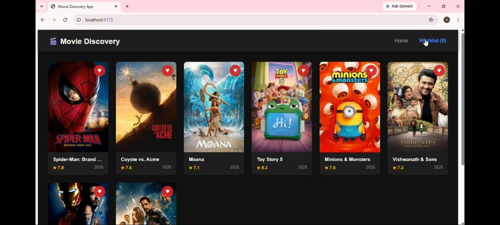

# 🎬 Movie Discovery Application

A full-stack movie discovery web application built with **React**, **Node.js**, and the **TMDB (The Movie Database) API**. Users can browse popular movies, search titles, filter by genre, sort results, view detailed movie information in a modal, and manage a persistent wishlist.

---

## 🎬 Project Demonstration

Watch the complete walkthrough video showing mobile responsiveness, movie details modals, search filtering, and wishlist management:

👉 **[Watch Live Demo Video](https://drive.google.com/file/d/1fjY-p5XwS7XENlvEb4vLfvwBg6wv1iVb/view?usp=drive_link)**

## ✨ Features

* **🍿 Dynamic Search & Filtering**
* **🎬 Movie Details Modal**
* **📱 Responsive Mobile Layout**interactions.
* **📌 Wishlist Management**
* **🔒 Secure API Proxy**

## 📸 Screenshots

### Homepage
<a href="./Home%20page.jpg">
  
</a>

### Search bar
<a href="./Search%20bar.jpg">
  
</a>

### Movie Details
<a href="./Movie%20detail.jpg">
  
</a>

### Wishlist
<a href="./Wishlist.jpg">
  
</a>

### Mobile View
<a href="./Mobile%20view.jpg">
  
</a>

## 📁 Repository Structure

```text
movie-discovery-app/
├── client(frontend)/
│   ├── node_modules/        # Client dependencies (git ignored)
│   ├── assets/              # Static media assets (images, icons, SVGs)
│   ├── pages/               # Top-level view/route components
|   |   ├── Home.jsx/        # Main movie discovery view page
|   |   ├── Wishlist.jsx/    # Saved wishlist movies view page
│   ├── components/          # Reusable UI sub-components
|   |    ├── MovieCard.jsx   # Individual movie card item component
|   |    ├── MovieDetailsModal.jsx  # Detailed view modal popup component
|   |    ├── Navbar.jsx      # Top navigation header component
│   ├── services/
│   │   └── api.js           # API request helpers
|   ├── App.css              # Main application component styles
│   ├── App.jsx              # Main React SPA component
│   ├── main.jsx             # React DOM root entry point
|   |── index.css            # Global CSS styling & baseline resets
│   ├── index.html           # HTML template
│   ├── package.json         # Frontend dependencies & scripts
│   ├── package-lock.json    # Locked dependency tree
│   └── vite.config.js       # Vite development configuration
├── server/
│   ├── node_modules/        # Server dependencies (git ignored)
│   ├── .env                 # API keys & server port (git ignored)
│   ├── wishlist.json        # Persistent wishlist storage
│   ├── server.js            # Express server, cache & TMDB layer
│   ├── package.json         # Backend dependencies & scripts
│   └── package-lock.json    # Locked dependency tree
└── README.md                # Project documentation & assignment setup
└── .gitignore               # Files to be ignored by github

```

### 🏗️ Technical Decisions & Architectural Highlights

**🔒 API Proxy:** Routes requests through an Express backend to hide TMDB secret keys and transform raw payloads.

**⚡ In-Memory Caching:** Uses a server-side Map with TTL expiration to minimize third-party API calls and prevent rate limiting.

**💾 Persistent Wishlist:** Synchronizes saved movies to a local wishlist.json file for client-side persistence across sessions.

**🔄 Server-Side Pagination:** Handles genre filtering, search, and pagination on the backend to keep client memory light.

### 🤖 AI Collaboration & Transparency Statement

This project was built with the assistance of **Google Gemini**, which served as an interactive coding partner for rapid setup, debugging, and layout optimization.

* **AI-Assisted Tasks**:
I used Gemini to quickly generate initial code structure for React components and Express routes, troubleshoot CORS blocking errors between my client and server, and figure out how to configure dynamic IP binding (window.location.hostname) so my phone could talk to my laptop over local Wi-Fi.

* **Developer Ownership & Core Implementation**:
I designed the app's overall structure, built the TMDB API logic and backend REST endpoints, set up the file-based JSON storage for saved movies, fixed responsive layout bugs on mobile screens, and tested the app across my desktop and physical phone.

### 🔮 Known Limitations & Future Enhancements
**Database Upgrade:** Upgrade file system JSON storage to SQLite or MongoDB to support multi-user wishlist profiles.

**Trailer Integration:** Add YouTube trailer previews inside the modal view via TMDB's video endpoint.

**Skeleton Loading Screens:** Upgrade plain text loading indicators to animated skeleton grid loaders.
